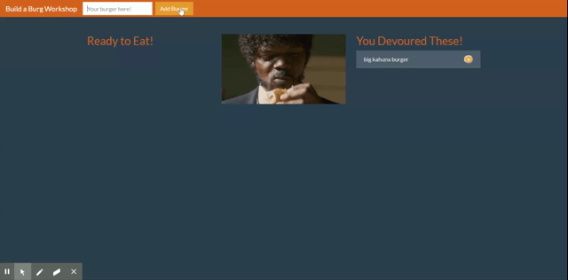

# burger-app

## Deployed Version

https://kyle-burger-app.herokuapp.com/

## Description

A burger based CRUD app utilizing javascript, MySQL, express-handlebars, and the MVC framework.

Add a burger of your design to the database using the text input in the upper left corner of the page. Then you can devour any of the
burgers in the database when you'd like using the button on the burger card

## Layout

MVC model. "models" and "db" folders function as the backend connected to a MySQL database. Communication between front and back end, as well as front end functionality is controlled in the "controllers" folder. Front end is rendered from the "views" folder.

## Technologies Used

- HTML
- CSS
- Javascript
- Bootstrap CSS library
- Bootswatch Bootstrap themes library

## Implementation

- Open server in terminal and run {node server}
- Navigate to database in MySQL workbench created via JAWSDB, copy and paste schema file and seeds file into workbench and run
- Navigate to "https://localhost:3306" in your browser

## Demo

